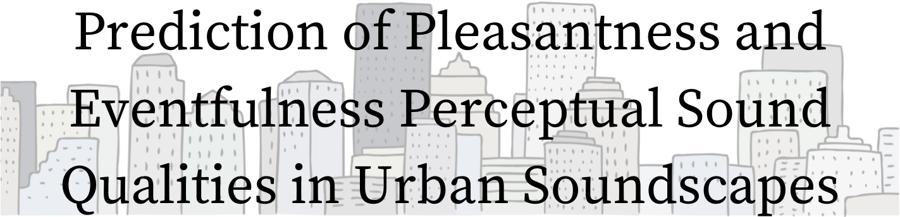
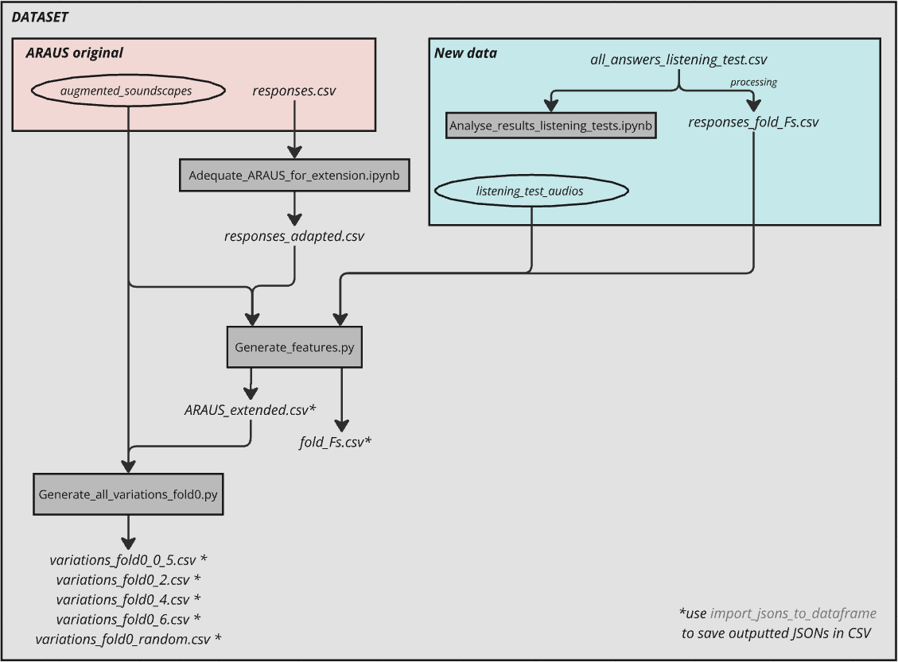
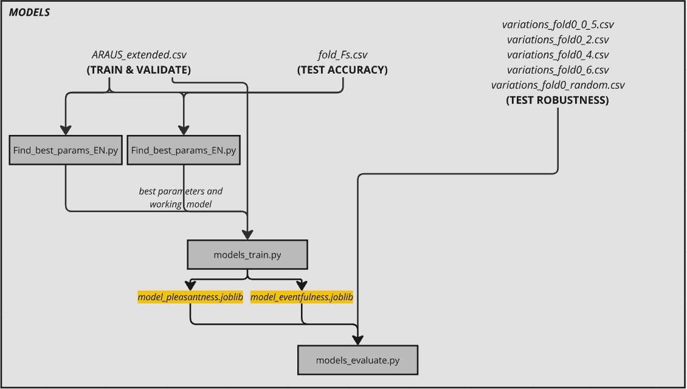
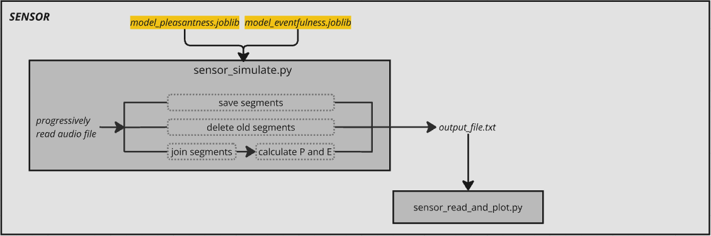
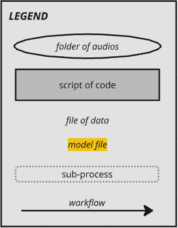
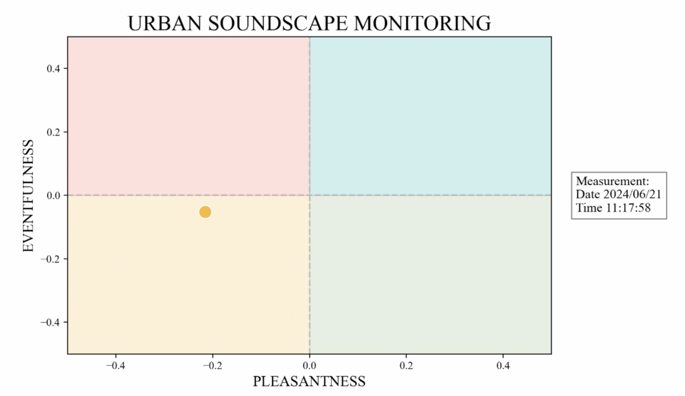

---
<!-- PROJECT LOGO -->

<div align="center">
  <a href="https://github.com/github_username/repo_name">
    
  </a>

<h3 align="center">Abstract</h3>

  <p align="center">
    The acoustic environment induces emotions in human listeners. To describe such emotions, ISO-12913 defines pleasantness and eventfulness as orthogonal properties that characterise urban soundscapes. In this paper, we study different approaches for automatically estimating these two perceptual sound qualities. We emphasize the comparison of three sets of audio features: a first set from the acoustic and psychoacoustic domain, suggested in ISO-12913; a second set of features from the machine listening domain based on traditional signal processing algorithms; and a third set consisting of audio embeddings generated with a pre-trained audio-language deep-learning model. Each feature set is tested on its own and in combination with ground-truth labels about the sound sources present in the recordings to determine if this additional information improves the prediction accuracy. Our findings indicate that the deep-learning representation yields slightly better performance than the other feature sets when predicting pleasantness, but all of them yield similar performance when predicting eventfulness. Nevertheless, deep-learning embeddings present other advantages, such as faster calculation times and greater robustness against changes in sensor calibration, making them more effective for real-time acoustic monitoring. Furthermore, we observe a clear correlation between the sound sources that are present in the urban soundscape and its induced emotions, specially regarding the sensation of pleasantness. Models like the ones proposed in this paper allow for an assessment of the acoustic environment that goes beyond a characterisation solely based on sound pressure level measurements and could be integrated into current acoustic monitoring solutions to enhance the understanding from the perspective of the induced emotions.
  </p>
  
</div>

<!-- TABLE OF CONTENTS 
<details>
  <summary>Table of Contents</summary>
  <ol>
    <li>
      <a href="#about-the-project">About The Project</a>
      <ul>
        <li><a href="#built-with">Built With</a></li>
      </ul>
    </li>
    <li>
      <a href="#getting-started">Getting Started</a>
      <ul>
        <li><a href="#prerequisites">Prerequisites</a></li>
        <li><a href="#installation">Installation</a></li>
      </ul>
    </li>
    <li><a href="#usage">Usage</a></li>
    <li><a href="#roadmap">Roadmap</a></li>
    <li><a href="#contributing">Contributing</a></li>
    <li><a href="#license">License</a></li>
    <li><a href="#contact">Contact</a></li>
    <li><a href="#acknowledgments">Acknowledgments</a></li>
  </ol>
</details> -->

<!-- ABOUT THE PROJECT -->
## About The Project

This work was supported by the project ''Soundlights: Distributed Open Sensors Network and Citizen Science for the Collective Management of the City's Sound Environments'' (9382417), a collaboration between the <i>Music Technology Group (Universitat Pompeu Fabra)</i> and <i>Bitlab Cooperativa Cultural</i>.

It is funded by <i>BIT Habitat (Ajuntament de Barcelona)</i> under the program <i>La Ciutat Proactiva</i>; and by the <i>IA y Música: Cátedra en Inteligencia Artificial y Música</i> (TSI-100929-2023-1) by the <i>Secretaría de Estado de Digitalización e Inteligencia Artificial</i> and <i>NextGenerationEU</i> under the program <i>Cátedras ENIA 2022</i>. 

<p>
  
  
  
  
</p>

<p align="right">(<a href="#readme-top">back to top</a>)</p>


## Reference
- Amaia Sagasti, Martín Rocamora, Frederic Font: *Prediction of Pleasantness and Eventfulness Perceptual Sound Qualities in Urban Soundscapes* - DCASE Workshop 2024 <a href="https://dcase.community/documents/workshop2024/proceedings/DCASE2024Workshop_Sagasti_12.pdf">Paper link DCASE webpage</a>
- Amaia Sagasti Martínez - MASTER THESIS: *Prediction of Pleasantness and Eventfulness Perceptual Sound Qualities in Urban Soundscapes* - Sound and Music Computing Master (Music Technology Group, Universitat Pompeu Fabra - Barcelona) <a href="https://zenodo.org/records/13861445">Master Thesis Report link Zenodo</a>


<!-- GETTING STARTED -->
## Getting Started
This section provides all the necessary information to set up the working environment. The followiing bullet-list details the set up process:
- It is recommended to use ```Python==3.10.14``` to guarantee compatibility.
- Install all the depencencies detailed in the ```requirements.txt``` file of this project. 
- <a href="https://github.com/LAION-AI/CLAP">LAION-AI's CLAP model</a> is used, make sure you install its dependencies too. Also, make sure to download LAION-AI's pre-trained model *630k-fusion-best.pt*.
- For reproducibility of the dataset generation, <a href="https://github.com/ntudsp/araus-dataset-baseline-models">ARAUS dataset</a> download and installation will be necessary. Specifically, you will need the metadata file ```responses.csv``` and the folder with the augmented urban soundscapes WAVs, ```augmented_soundscapes```. Follow the steps specified in their Github page to download/generate the mentioned files. 

<p align="right">(<a href="#readme-top">back to top</a>)</p>

<!-- ## Soundlights sensors
Soundlights is a technological and social project that aims to develop and implement a network of intelligent microphone sensors to be deployed in the city of Barcelona. These sensors capture the audio in real-time and process it to extract two acoustic perceptual qualities, pleasatness and eventfulness. Then, the obtained acoustic environment information will be displayed on a digital display. The main goals of Soundlights are:
- To collect data from the urban soundscapes in the city of Barcelona to gain knowledge of the noise environment from a perceptual point of view.
- To implement a display that delivers messages in real-time to raise *in situ* and long-term awareness of noise levels.

Both <a href="#reference">reference</a> documents provided above are part of a research line for finding which feature set and model delivers the highest accuracy in the predictions of the perceptual qualities pleasantness and eventfulness, with special focus on real-time applications. For this purpose, <a href="#araus-extended-dataset">ARAUS-extended dataset</a> is developped, and three different feature sets are put under test.

*CLAP features*, the sound representations explained in the following section, result as the most suitable for real-time monitoring techniques because they achieve strong accuracy in the predictions, they are the fastest to generate, and they are the most robust to changes in audio-calibration. Therefore, we use the *CLAP features* of the five cross-validation folds of ARAUS dataset to train two models for the prediction of pleasantness and eventfulness, respectively, and save them. 

In addition to the pleasantness and eventfulness prediction models, this repository includes the development of urban sound source identification models too. In comparisson to the perceptual qualities, not as much effort and research was put into the study of this models. The audio recordings from <a href="https://github.com/jakobabesser/USM">USM dataset</a> and *CLAP features* were used to train one-vs-all models for predicting the following sound sources: airplane, alarm, birds, bus, car, cheering, church bell, dogs, drilling, glass break, gunshot, hammer, helicopter, jackhammer, lawn mower, motorcycle, music, rain, sawing, scream, siren, speech, thunderstorm, train, truck and wind.

The final step of this research, as part of the Soundlights project, is to implement the trained models in a sensor that operates in real-time. This sensor will capture sound, process it by making the predictions with the trained models and output a message with information about the acoustic environment. In this code repository, you can find code for simulating the working of one of this sensors operating in real-time, using a WAV file as input. -->
## ARAUS-extended dataset
ARAUS-extended dataset is a more comprehensive version of the original ARAUS dataset.

ARAUS-extended contains the same 25440 augmented urban soundscape audios (organised in 5 train-validation folds and one testing fold) found in ARAUS original dataset. Additionally, it includes another testing fold created with 25 real urban soundscapes recordings downloaded from the <a href="#https://freesound.org/">Freesound sound library</a>. We refer to this fold as <i>fold-Fs</i>.

While the original ARAUS dataset includes a set of acoustic and psychoacoustic features, ARAUS-extended contains these same features along with two additional feature sets: signal processing features (generated with <a href="https://essentia.upf.edu/freesound_extractor.html">FreesoundExtractor</a> from Essentia's library) and a set of CLAP embeddings (generated with <a href="https://github.com/LAION-AI/CLAP">LAION-AI's CLAP</a> pre-trained model *630k-fusion-best.pt*). 

ARAUS-Extended Dataset: <a href="data/ARAUS_extended.csv">CSV version</a>, <a href="data/ARAUS_extended.json">JSON version</a>
<p></p>
<i>ARAUS-Extended Fold-Fs</i>: <a href="data/fold_Fs.csv">CSV version</a>,  <a href="data/fold_Fs.json">JSON version</a>
<p></p>
This repository contains the code necessary for reproducibility of the generation of ARAUS-extended dataset:

1) Adapt ARAUS original dataset for extension <a href="src/scripts/dataset/dataset_Adequate_ARAUS_for_extension.ipynb">Script</a> 
2) Generate ARAUS-extended <a href="src/scripts/dataset/dataset_Generate_features.py">Script</a> 

Besides this code for re-generating ARAUS-extended dataset, in <a href="src/scripts/dataset/">the dataset scripts folder </a> you can find other codes for:
- Checking Leq of the original augmented soundscapes from ARAUS dataset and the new set of audios belonging to *fold-Fs* <a href="src/scripts/dataset/dataset_Leq_comparison.ipynb">Script</a>
- Analysing the answers of the listening test <a href="src/scripts/dataset/dataset_Analyse_results_listening_tests.ipynb">Script</a>
- Generating all <a href="data/variations_fold0">variations </a> of ARAUS testing fold, *fold-0*, for testing models' robustness to changes in sensor calibrations <a href="src/scripts/dataset/dataset_Generate_all_variations_fold0.py">Script</a>
- Comparison of ARAUS original acoustic and psychoacoustic features to the ones generated for ARAUS-extended (with the code found in this repo). <a href="src/scripts/dataset/dataset_Check_ARAUS-extended.ipynb">Script</a>










## Models predicting Pleasantness and Eventfulness
The research (see <a href="#reference">References</a>) shows that CLAP embeddings generated by LAION-AI's CLAP model demonstrate high performance as input to models for predicting *pleasantness* and *eventfulness* perceptual sound qualities. These embeddings stand out for their ability to capture semantic information without requiring additional sound source data helping in the prediction.  Even though the sound representation does not present strong robustness to variations in sensor calibration, it can be computed rapidly, making it suitable for real-time applications.

You can find the developped models here: <a href="data/models/trained/model_eventfulness.joblib">Pleasantness</a> and <a href="data/models/trained/model_eventfulness.joblib">Eventfulness</a>.

There is also code allowing for reproducibility of the model training:
- After preliminary experiments, Elastic Net and RFR algorithms demonstrated the greatest performance. These scripts, <a href="src/scripts/model/models_Find_best_params_ElasticNet.py">1</a> and <a href="src/scripts/model/models_Find_best_params_RFR.py">2</a>, contain code for the search of the best configuration.
- This <a href="src/scripts/model/models_train.py">script</a> generates the best two models, the ones that are saved.
- Finally, there is code to test the performance of the saved models on the controlled variations of *fold-0* <a href="src/scripts/model/models_evaluate.py">script</a>


## Simulation
Future research directions could include evaluating the developed models in the context of a real-world acoustic sensor network and incorporating sound classification and source separation technologies to improve the models' accuracy and capabilities for meaningful soundscape characterisation and monitoring. 

This work is still in progress in the framework of the *SOUNDLIGHTS* project. However, you can already find code to simulate such functionalities:

To test the developed models for predicting the pleasantness (P) and eventfulness (E) values, two scripts have been implemented and are ready to run. These scripts simulate the functionality of an acoustic environment sensor by processing a WAV file of an urban soundscape recording. 

1) The first <a href="src/scripts/sensor/sensor_simulation.py">script</a> constitutes the sensor capturing and processing: in "real time", the audio file is read continuously and, every few seconds, the predicted values of P and E are outputted in a text file. 
2) The second <a href="src/scripts/sensor/sensor_read_and_plot.py">script</a> operates by reading the most recent line from the aforementioned text file in real-time and plotting the values on a simple interface.

*Note: Run both scripts simultaneously in different terminals.*



In fact, a short demo video was created with the provided simulation code <a href="https://youtu.be/f1YHKgZXTTw">Demo 1</a>. 

Additionally, here is a sneak-peak of other capabilities we are working on...<a href="https://youtu.be/fsis4OViLwQ">Demo 2</a>.


<p align="right">(<a href="#readme-top">back to top</a>)</p>


<!-- LICENSE -->
## License

Distributed under the ...<!-- MIT License. See `LICENSE.txt` for more information.<p align="right">(<a href="#readme-top">back to top</a>)</p>-->


<!-- MARKDOWN LINKS & IMAGES -->
<!-- https://www.markdownguide.org/basic-syntax/#reference-style-links -->
[contributors-shield]: https://img.shields.io/github/contributors/github_username/repo_name.svg?style=for-the-badge
[contributors-url]: https://github.com/github_username/repo_name/graphs/contributors
[forks-shield]: https://img.shields.io/github/forks/github_username/repo_name.svg?style=for-the-badge
[forks-url]: https://github.com/github_username/repo_name/network/members
[stars-shield]: https://img.shields.io/github/stars/github_username/repo_name.svg?style=for-the-badge
[stars-url]: https://github.com/github_username/repo_name/stargazers
[issues-shield]: https://img.shields.io/github/issues/github_username/repo_name.svg?style=for-the-badge
[issues-url]: https://github.com/github_username/repo_name/issues
[license-shield]: https://img.shields.io/github/license/github_username/repo_name.svg?style=for-the-badge
[license-url]: https://github.com/github_username/repo_name/blob/master/LICENSE.txt
[linkedin-shield]: https://img.shields.io/badge/-LinkedIn-black.svg?style=for-the-badge&logo=linkedin&colorB=555
[linkedin-url]: https://linkedin.com/in/linkedin_username
[product-screenshot]: images/screenshot.png
[Next.js]: https://img.shields.io/badge/next.js-000000?style=for-the-badge&logo=nextdotjs&logoColor=white
[Next-url]: https://nextjs.org/
[React.js]: https://img.shields.io/badge/React-20232A?style=for-the-badge&logo=react&logoColor=61DAFB
[React-url]: https://reactjs.org/
[Vue.js]: https://img.shields.io/badge/Vue.js-35495E?style=for-the-badge&logo=vuedotjs&logoColor=4FC08D
[Vue-url]: https://vuejs.org/
[Angular.io]: https://img.shields.io/badge/Angular-DD0031?style=for-the-badge&logo=angular&logoColor=white
[Angular-url]: https://angular.io/
[Svelte.dev]: https://img.shields.io/badge/Svelte-4A4A55?style=for-the-badge&logo=svelte&logoColor=FF3E00
[Svelte-url]: https://svelte.dev/
[Laravel.com]: https://img.shields.io/badge/Laravel-FF2D20?style=for-the-badge&logo=laravel&logoColor=white
[Laravel-url]: https://laravel.com
[Bootstrap.com]: https://img.shields.io/badge/Bootstrap-563D7C?style=for-the-badge&logo=bootstrap&logoColor=white
[Bootstrap-url]: https://getbootstrap.com
[JQuery.com]: https://img.shields.io/badge/jQuery-0769AD?style=for-the-badge&logo=jquery&logoColor=white
[JQuery-url]: https://jquery.com 
