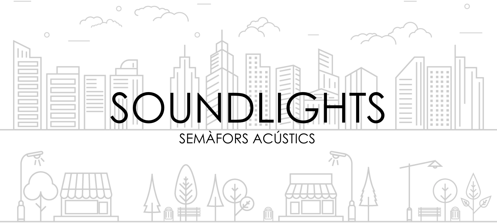
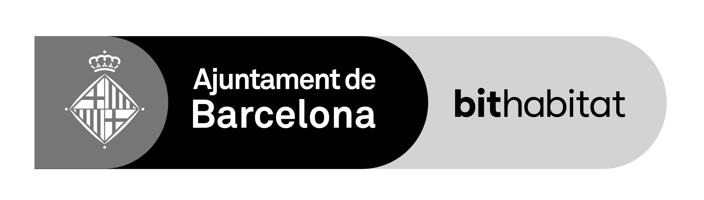

---
<!-- PROJECT LOGO -->
<br />
<div align="center">
  <a href="https://github.com/github_username/repo_name">
    
  </a>

<h3 align="center">SOUNDLIGHTS</h3>

  <p align="center">
    Research and development of AI models to predict the perceptual sound qualities of "pleasantness" and "eventfulness" in urban soundscapes with focus on prediction accuracy and suitability to real-time implementations.
  </p>
  
</div>

<!-- TABLE OF CONTENTS 
<details>
  <summary>Table of Contents</summary>
  <ol>
    <li>
      <a href="#about-the-project">About The Project</a>
      <ul>
        <li><a href="#built-with">Built With</a></li>
      </ul>
    </li>
    <li>
      <a href="#getting-started">Getting Started</a>
      <ul>
        <li><a href="#prerequisites">Prerequisites</a></li>
        <li><a href="#installation">Installation</a></li>
      </ul>
    </li>
    <li><a href="#usage">Usage</a></li>
    <li><a href="#roadmap">Roadmap</a></li>
    <li><a href="#contributing">Contributing</a></li>
    <li><a href="#license">License</a></li>
    <li><a href="#contact">Contact</a></li>
    <li><a href="#acknowledgments">Acknowledgments</a></li>
  </ol>
</details> -->


Additionally, an example code of a simulation is included: a recorded audio file simulates an audio being captured in real time, pleasantness and eventfulness values are calculated every few seconds.
<!-- ABOUT THE PROJECT -->
## About The Project
<p align="left">
    This project is a colaboration between the following institutions:
    <p>
        
    </p>
    <p>
    
    </p>
    Funded by:
    <p>
    
    </p>
  </p>

<p align="right">(<a href="#readme-top">back to top</a>)</p>


## Reference
- Amaia Sagasti, Martín Rocamora, Frederic Font: *Prediction of Pleasantness and Eventfulness Perceptual Sound Qualities in Urban Soundscapes* - DCASE Workshop 2024 <a href="link-to-paper-once-published">Paper link</a>
- Amaia Sagasti Martínez - MASTER THESIS: *Prediction of Pleasantness and Eventfulness Perceptual Sound Qualities in Urban Soundscapes* - Sound and Music Computing Master (Music Technology Group, Universitat Pompeu Fabra - Barcelona) <a href="link-to-MasterThesis-once-published">Master Thesis Report link</a>

## Soundlights sensors
Soundlights is a technological and social project that aims to develop and implement a network of intelligent microphone sensors to be deployed in the city of Barcelona. This sensors capture the audio in real-time and process it to extract acoustic perceptual qualities. Then, the acoustic environment information will be displayed on a digital sign. The main goals of Soundlights are:
- To collect data from the urban soundscapes in the city of Barcelona to gain knowledge of the noise environment from a perceptual point of view
- To implement a display that delivers messages in real-time to raise *in situ* awareness of to reduce noise levels

Both <a href="#reference">reference</a> documents provided above are part of a research line for finding which feature set and model delivers the highest accuracy in the predictions of the perceptual qualities pleasantness and eventfulness, with special focus on real-time applications. For this purpose, <a href="#araus-extended-dataset">ARAUS-extended dataset</a> is developped, and three different feature sets are put under test.

*CLAP features*, the sound representations explained in the following section, result as the most suitable for real-time monitoring techniques because they achieve strong accuracy in the predictions, they are the fastest to generate, and they are the most robust to changes in audio-calibration. Therefore, we use the *CLAP features* of the five cross-validation folds of ARAUS dataset to train two models for the prediction of pleasantness and eventfulness, respectively, and save them. 

In addition to the pleasantness and eventfulness prediction models, this repository includes the development of urban sound source identification models too. In comparisson to the perceptual qualities, not as much effort and research was put into the study of this models. The audio recordings from <a href="https://github.com/jakobabesser/USM">USM dataset</a> and *CLAP features* were used directly to train one-vs-all models for predicting the following sound sources: airplane, alarm, birds, bus, car, cheering, church bell, dogs, drilling, glass break, gunshot, hammer, helicopter, jackhammer, lawn mower, motorcycle, music, rain, sawing, scream, siren, speech, thunderstorm, train, truck and wind.

The final step of this research, as part of the Soundlights project, is to implement the trained models in a sensor that operates in real-time. This sensor will capture sound, process it by making the predictions with the trained models and output a message with information about the acoustic environment. In this code repository, you can find code for simulating the working of one of this sensors operating in real-time, using a WAV file as input.

## ARAUS-extended dataset
ARAUS-extended dataset is a more comprehensive version of the <a href="https://github.com/ntudsp/araus-dataset-baseline-models">ARAUS dataset</a>. 

ARAUS-extended is formed by the same 25400 augmented urban soundscape audios (organised in 5 train-validation folds and one testing fold) found in ARAUS original dataset. Additionally, it includes another testing fold created with 25 real urban soundscapes recordings downloaded from the <a href="#https://freesound.org/">Freesound sound library</a>. 

While the original ARAUS dataset includes a set of acoustic and psychoacoustic features, ARAUS-extended contains these same features along with two additional feature sets: signal processing features and a set of CLAP embeddings. This repository contains the code necessary for reproducibility of the generation of ARAUS-extended dataset. 

In this README file, and in the two <a href="#reference">reference</a> documents included above, we are refering to the three mentioned feature sets of ARAUS-extended dataset as:
- *ARAUS features* to the acoustic and psychoacoustic features of ARAUS original dataset, based on the ISO-12913.
- *Freesound features* to the signal processing features generated with <a href="https://essentia.upf.edu/freesound_extractor.html">FreesoundExtractor()</a> from Essentia's library.
- *CLAP features* to the sound representations generated with <a href="https://github.com/LAION-AI/CLAP">LAION-AI's CLAP</a> pre-trained model *630k-fusion-best.pt* .


## Demo
You can find two short demo videos created with the provided simulation code (see <a href="#usage">ARAUS dataset</a> section) of the simulations of real-time predictions of:
- Pleasantness and eventfulness in <a href="link-to-demo-1">Demo 1</a>.
- Sound sources present, pleasantness and eventfulness in <a href="link-to-Demo-2">Demo 2</a>.

These demos simulate a sensor that captures audio in real-time and uses models trained with the 25440 augmented soundscapes of ARAUS or ARAUS-extended datasets, and LAION-AI's CLAP embeddings as input features. 

<!-- GETTING STARTED -->
## Getting Started
This section provides all the necessary information to set up the working environment. The followiing bullet-list details the set up process:
- It is recommended to use ```Python==3.10.14``` to guarantee compatibility.
- Install all the depencencies detailed in the ```requirements.txt``` file of this project. 
- <a href="https://github.com/LAION-AI/CLAP">LAION-AI's CLAP model</a> is used, make sure you install its dependencies too.
- For reproducibility, <a href="https://github.com/ntudsp/araus-dataset-baseline-models">ARAUS dataset</a> download and installation will be necessary. Specifically, you will need the metadata file ```responses.csv``` and the folder with the augmented urban soundscapes WAVs, ```augmented_soundscapes```. Follow the steps specified in their Github page to download/generate the mentioned file and folder. 


<p align="right">(<a href="#readme-top">back to top</a>)</p>


<!-- USAGE EXAMPLES -->
## Usage

To test the developed models for predicting the pleasantness (P) and eventfulness (E) values of an urban soundscape, two scripts have been implemented and are ready to run. These scripts simulate the functionality of an acoustic environment sensor by processing a WAV file of an urban soundscape recording. The simulation operates in "real time," where the audio file is read continuously, and every X seconds, the scripts output the predicted values of P and E. This setup allows for the real-time analysis and evaluation of the acoustic environment based on the provided recordings.

The first script is ```src/scripts/sensor_simulate.py```. To run this script, the function ```play_audio()``` is called:
```
play_audio(
    path,
    frequency,
    duration,
    maintain_time,
)
```
The first input is the path to the audio file that will simulate a real-time recording. The second input specifies the frequency, in seconds, at which new predictions for pleasantness (P) and eventfulness (E) will be made. This also determines the duration of the audio slices that will be saved locally. The third parameter defines the duration, in seconds, of audio that will be considered for prediction calculations. This duration must be an integer multiple of the frequency, allowing an exact number of audio slices to be concatenated. Finally, the fourth input sets the duration, in seconds, for which the audio slices will be stored locally. This value should be as small as possible but must be greater than or equal to the "duration" parameter and also an integer multiple of the "frequency. 

This function saves the predicted values of P and E in a text file, with each new pair of values written on a new line.

The second script, src/scripts/sensor_read_and_plot.py, operates by reading the most recent line from the aforementioned text file in real-time and plotting the values on a simple interface.


<p></p>
A demo of this simulation can be found <a href="link!!!">here </a>.
<p></p>
If you wish to integrate the predictions into your own code, you can find the models for predicting pleasantness and eventfulness in the ´´´/models/trained´´´ directory. These models require LAION-AI's CLAP embeddings of the input audio.

<p align="right">(<a href="#readme-top">back to top</a>)</p>


## Reproducibility

### Generation of the dataset ARAUS-extended


1) Preliminary adaptation
   ---

    Data needed: responses.csv (from ARAUS original dataset)
   
    Script to run: `dataset_Adequate_ARAUS_for_extension.ipynb`

    Result: responses_Soundlights.csv
    
    ---

2) Generate dataset ARAUS-extended
3) Generate fold0 variations
4) Generate fold-Fs - listening test analysis

### Overview
Our project aims to [brief description of the project's long-term goals and vision].


### Contributors' Guide

We welcome contributions to help achieve these milestones. Please check out our [contributing guide](CONTRIBUTING.md) for more details on how to get involved.


<!-- CONTRIBUTING -->
## Contributing

Contributions are what make the open source community such an amazing place to learn, inspire, and create. Any contributions you make are **greatly appreciated**.

If you have a suggestion that would make this better, please fork the repo and create a pull request. You can also simply open an issue with the tag "enhancement".
Don't forget to give the project a star! Thanks again!

1. Fork the Project
2. Create your Feature Branch (`git checkout -b feature/AmazingFeature`)
3. Commit your Changes (`git commit -m 'Add some AmazingFeature'`)
4. Push to the Branch (`git push origin feature/AmazingFeature`)
5. Open a Pull Request

<p align="right">(<a href="#readme-top">back to top</a>)</p>


<!-- LICENSE -->
## License

Distributed under the MIT License. See `LICENSE.txt` for more information.

<p align="right">(<a href="#readme-top">back to top</a>)</p>


<!-- CONTACT -->
## Contact

Your Name - [@twitter_handle](https://twitter.com/twitter_handle) - email@email_client.com

Project Link: [https://github.com/github_username/repo_name](https://github.com/github_username/repo_name)

<p align="right">(<a href="#readme-top">back to top</a>)</p>


<!-- ACKNOWLEDGMENTS -->
## Acknowledgments

* []()
* []()
* []()

<p align="right">(<a href="#readme-top">back to top</a>)</p>


<!-- MARKDOWN LINKS & IMAGES -->
<!-- https://www.markdownguide.org/basic-syntax/#reference-style-links -->
[contributors-shield]: https://img.shields.io/github/contributors/github_username/repo_name.svg?style=for-the-badge
[contributors-url]: https://github.com/github_username/repo_name/graphs/contributors
[forks-shield]: https://img.shields.io/github/forks/github_username/repo_name.svg?style=for-the-badge
[forks-url]: https://github.com/github_username/repo_name/network/members
[stars-shield]: https://img.shields.io/github/stars/github_username/repo_name.svg?style=for-the-badge
[stars-url]: https://github.com/github_username/repo_name/stargazers
[issues-shield]: https://img.shields.io/github/issues/github_username/repo_name.svg?style=for-the-badge
[issues-url]: https://github.com/github_username/repo_name/issues
[license-shield]: https://img.shields.io/github/license/github_username/repo_name.svg?style=for-the-badge
[license-url]: https://github.com/github_username/repo_name/blob/master/LICENSE.txt
[linkedin-shield]: https://img.shields.io/badge/-LinkedIn-black.svg?style=for-the-badge&logo=linkedin&colorB=555
[linkedin-url]: https://linkedin.com/in/linkedin_username
[product-screenshot]: images/screenshot.png
[Next.js]: https://img.shields.io/badge/next.js-000000?style=for-the-badge&logo=nextdotjs&logoColor=white
[Next-url]: https://nextjs.org/
[React.js]: https://img.shields.io/badge/React-20232A?style=for-the-badge&logo=react&logoColor=61DAFB
[React-url]: https://reactjs.org/
[Vue.js]: https://img.shields.io/badge/Vue.js-35495E?style=for-the-badge&logo=vuedotjs&logoColor=4FC08D
[Vue-url]: https://vuejs.org/
[Angular.io]: https://img.shields.io/badge/Angular-DD0031?style=for-the-badge&logo=angular&logoColor=white
[Angular-url]: https://angular.io/
[Svelte.dev]: https://img.shields.io/badge/Svelte-4A4A55?style=for-the-badge&logo=svelte&logoColor=FF3E00
[Svelte-url]: https://svelte.dev/
[Laravel.com]: https://img.shields.io/badge/Laravel-FF2D20?style=for-the-badge&logo=laravel&logoColor=white
[Laravel-url]: https://laravel.com
[Bootstrap.com]: https://img.shields.io/badge/Bootstrap-563D7C?style=for-the-badge&logo=bootstrap&logoColor=white
[Bootstrap-url]: https://getbootstrap.com
[JQuery.com]: https://img.shields.io/badge/jQuery-0769AD?style=for-the-badge&logo=jquery&logoColor=white
[JQuery-url]: https://jquery.com 
